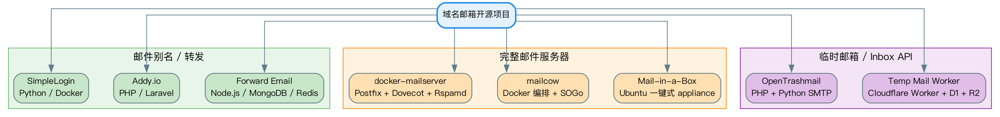
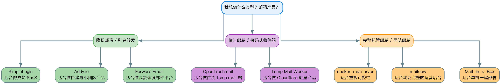

# GitHub 高星域名邮箱项目盘点：8 个值得研究的开源方案

最近翻了一圈域名邮箱相关项目，原本只是想找几个和 `cloudflare_temp_email` 接近的仓库，结果越看越觉得，这个方向特别容易被“项目名字”带偏。

因为 GitHub 上那些看起来都和邮箱有关的项目，实际上根本不是同一类东西。

有的做的是隐私邮箱别名，把真实邮箱藏在后面；有的做的是完整邮件服务器，SMTP、IMAP、反垃圾、Webmail 一套全包；还有的干脆就是临时邮箱，重点不是“邮箱系统”，而是“收信结果怎么尽快交给人或者交给程序”。

如果不先把这几条路线拆开，文章很容易写成仓库清单。看着热闹，读完其实没留下什么判断。

所以这篇不按“项目介绍模板”来写，我更想把这 8 个项目放进同一张地图里，看看它们各自站在什么位置。截至 **2026 年 4 月 14 日**，我挑了 8 个还比较活跃、GitHub 星标也比较有代表性的开源项目，它们刚好能把“域名邮箱”这件事的主流路线覆盖得差不多。

先说我的整体判断。真正适合长期产品化的，通常不是最重的那类完整邮件服务器，而是别名转发和轻量收信这两条线。前者更接近隐私产品，后者更接近工具产品。完整邮件服务器当然更强，但你一旦往那条路走，本质上就是在运营一家邮件服务商，难度完全不是一个量级。

## 先把路线分清楚

这 8 个项目，大致可以分成三堆。

第一堆是 `SimpleLogin`、`Addy.io`、`Forward Email`。它们最核心的事情，不是给用户一个“完整邮箱”，而是处理邮箱身份和转发链路。用户对外暴露的是 alias，真正收件可能还在 Gmail、Proton 或别的邮箱服务里。这一类项目的产品感通常比较强，因为它解决的是一个很直接的痛点：我不想把真实邮箱暴露给所有网站。

第二堆是 `docker-mailserver`、`mailcow`、`Mail-in-a-Box`。这三个都属于完整邮件服务器路线。也就是说，你不只是做一个功能，而是在接手 SMTP、IMAP、账号管理、反垃圾、证书、DNS 策略、备份和监控这些事情。这类项目更像基础设施，不太像轻量产品。

第三堆是 `OpenTrashmail` 和 `Temp Mail Worker`。这两个方向更偏临时邮箱和收件 API。它们要解决的问题非常具体：邮件怎么收进来，怎么存下来，怎么通过页面、API 或 webhook 交给用户。和完整邮件服务器相比，这条路线要克制得多，但也因此更适合做小而快的产品。

把这三条线分清楚之后，再看每个项目就不会乱。

## SimpleLogin：它做的不是邮箱，而是邮箱身份层

SimpleLogin 现在大概 `6592` 星，主语言是 Python，最近一次仓库更新在 `2026-04-08`。它是这一批项目里产品感最强的一个，也是最适合拿来研究“隐私邮箱为什么能做成独立产品”的案例。

这个项目最有意思的地方，在于它的定位非常准确。它并不试图取代 Gmail 或 Proton，也不急着往完整邮件服务器那条路上走。它真正做的，是站在真实邮箱前面，做一个身份代理层。用户对外暴露的是 alias，外部邮件先打到 alias，再由系统转发到真实收件箱。继续往前走，它还支持匿名回复、域名接入、浏览器扩展和移动端入口，这时候它就不只是一个“转发工具”了，而是一整套围绕邮箱身份保护设计出来的产品。

从技术栈上看，SimpleLogin 走的是比较稳的路线。后端是 Python，自托管依赖 Docker，部署仍然需要一台像样的 Linux 服务器，README 里还专门提到内存建议至少 2GB。再往下看，MX、DKIM、SPF、DMARC 这些邮件基础设施配置一个都绕不过去。这说明它虽然是别名路线，但绝不是“装个脚本就能跑”的轻量玩具。

如果从功能模块去拆，它最重要的其实就几层。第一层是 alias 本身，也就是地址生成、禁用、删除、归档这些围绕别名展开的能力；第二层是域名接入，要把用户自己的域名纳进来；第三层是匿名回复和发信链路；第四层是浏览器插件、移动端这些入口。这里面最值得写进文章的，不是它支持了多少功能，而是它所有模块都围绕同一个中心转：别名地址才是这个产品的核心资产。

这也是它和完整邮件服务器最大的不同。完整邮件服务器追求的是“邮箱能力完整”，而 SimpleLogin 追求的是“邮箱身份隔离做深”。这两种思路没有谁高谁低，但产品化难度完全不同。SimpleLogin 这种路线更容易做出用户愿意长期使用的服务，因为用户价值非常直接，甚至一句话就能讲明白。

不过它也有自己的难点。你真要拿这条路做独立产品，真正麻烦的不是页面，而是域名接入体验、匿名回复是否泄露真实邮箱、滥用注册、发信信誉、退信处理这些细节。别名产品最怕的不是“功能不够多”，而是链路不够严，一旦严谨性不够，整个产品价值会直接打折。

## Addy.io：和 SimpleLogin 很像，但气质更轻一点

Addy.io 现在大概 `4575` 星，主语言是 PHP，最近一次活跃时间是 `2026-04-10`。很多人对它更熟悉的旧名字其实是 `AnonAddy`。

它和 SimpleLogin 站在同一条大路上，做的也是隐私邮箱别名和转发，但气质不太一样。SimpleLogin 更像一个完整商业产品，而 Addy.io 给人的感觉更轻，也更强调自建和隐私控制。

这个项目让我印象很深的一点，是它把 alias 这件事分得很细。README 里会明确讲 shared domain alias、standard alias、custom domain alias 这些概念。别看这只是几个名字，背后其实对应的是非常真实的产品边界。因为用共享域名和用自定义域名，本来就不是同一类用户；临时生成地址和长期运营地址，也不是同一类场景。Addy.io 没把它们混在一起，而是直接拆成了不同模型。

这会让整个产品显得特别“运营化”。你能看出来，它不是只想着把邮件转发过去，而是在思考别名如何生成、如何分类、如何限制滥用、如何做带宽和配额管理。再加上它对 PGP/OpenPGP 的支持，这个项目很明显是在围绕“隐私邮箱”这件事持续打磨，而不是只做一个最小功能集合。

从文章角度说，Addy.io 特别适合写成“为什么别名产品比临时邮箱更容易长期经营”的例子。因为别名产品一旦和自定义域名、回复链路、加密转发结合起来，就已经不是一次性工具，而是一种稳定使用的邮箱工作流。

真要拿它做产品参考，我觉得最值得记住的是两点。第一，子域名策略非常重要，别轻易把主域名直接切给别名系统；第二，共享域名和用户私有域名一定要隔开，不然信誉、滥用和资源分配都会变得很难管。很多时候，项目的复杂度不是来自协议，而是来自这些产品边界。

## Forward Email：名字看起来简单，实际已经很平台化

Forward Email 现在大概 `1557` 星，主语言是 JavaScript，最近一次更新在 `2026-04-13`。如果只看名字，很容易把它脑补成一个“邮箱转发服务”。但只要认真读一遍 README，就会发现这已经不是轻量项目了。

这个仓库最明显的特征，就是它的服务拆分特别多。Web、API、SMTP、MX、IMAP、POP3、SQLite、CalDAV、CardDAV 都有对应的开发入口，依赖里还直接列出了 MongoDB、Redis、pnpm 这些东西。换句话说，它不是做单点功能，而是在搭一个完整邮件平台。

这种项目最适合研究什么叫“邮件产品工程化”。因为它已经不是一个把功能堆进去就能跑的服务，而是一套多服务协作、多协议并存、还要考虑运维自动化和多节点部署的系统。你看它的 README，就能感受到一种明显的平台气质。

也正因为这样，它和 SimpleLogin、Addy.io 的区别会非常明显。后两者更像围绕邮箱身份和隐私做产品，而 Forward Email 则更像围绕邮件能力本身做平台。它的复杂度不是来自某一个功能点，而是来自服务组合本身。

如果要写最佳实践，我反而不会从功能说起，而会强调服务边界。像这种项目，Web/API 层、协议层、任务层、存储层必须从一开始就拆清楚，不然越做越难收拾。对独立开发者来说，它更适合拿来研究架构，而不是直接照着做 MVP。因为一旦同时承接 IMAP、SMTP、POP3，再加上真实用户和多域名，监控、故障定位、信誉维护都会迅速变难。

## mailcow：功能完整，社区成熟，但它本质上还是完整邮件系统

mailcow 现在大概 `12538` 星，最近仓库活跃时间是 `2026-04-11`。这是很多人搜“自建域名邮箱”时迟早会撞上的项目，因为它的知名度、文档和社区都已经相当成熟。

mailcow 的优势很直白：它把完整邮件系统包装成了相对容易部署的一套成品。底层还是那些熟悉的组件，比如 Postfix、Dovecot、Rspamd、ClamAV、SOGo，但用户不需要自己一个个拼。你可以把它理解成“我不想从零搭完整邮件栈，但我又确实要一套完整邮件服务”，那 mailcow 就很顺。

它为什么受欢迎，其实也不难理解。因为很多团队并不想研究每个组件的细枝末节，他们要的是一个有后台、有管理界面、有域名管理、有 Webmail、有反垃圾策略的完整系统。mailcow 正好处在这个位置上。

但问题也在这里。很多人第一次接触这类项目时，会把“安装体验比较省事”和“系统本身很轻”混为一谈。mailcow 虽然部署友好，但本质上仍然是完整邮件栈。也就是说，备份、监控、证书、信誉、反垃圾、恢复，这些运营问题你一个都跑不掉。

如果你准备拿它做独立产品，更要把这一点想清楚。你卖的绝不只是一个邮箱界面，而是稳定性、可靠性和恢复能力。多租户、组织管理、审计和计费这些 SaaS 层能力，mailcow 也不会天然替你补上。它非常适合做自建方案和团队基础设施，但不代表直接套上去就是商业产品。

## docker-mailserver：星最高，但它的价值在“克制”

docker-mailserver 现在大概 `18108` 星，是这篇里星标最高的一个，最近一次活跃在 `2026-04-13`。不过我觉得它真正值得讲的，反而不是星标，而是项目哲学。

README 里有一句话特别能代表它的思路，大意是“只有配置文件，没有 SQL 数据库，保持简单、可版本化”。这句话一出来，其实整个项目的味道就很明确了。它不是要给你做一个炫目的控制台，而是给你一套尽量克制、尽量可控的完整邮件栈。

Postfix、Dovecot、Rspamd、SpamAssassin、ClamAV、OpenDKIM、OpenDMARC、Fail2ban，这些成熟组件被组织在一起，然后用配置去驱动。这种方式特别适合那些愿意自己理解邮件系统的人。你不会被一层厚厚的平台包装隔开，出了问题也比较容易知道是 DNS、协议、策略还是信誉出了问题。

和 mailcow 比，docker-mailserver 更偏基础设施；和 Mail-in-a-Box 比，它又少了一点 appliance 的味道，更适合愿意自己折腾配置的人。很多时候，项目做得“克制”反而是优点，因为它意味着你的系统边界更清楚。

当然，这类项目最容易让人低估的，是产品层工作量。协议能力很强，不代表产品就已经完成了。你如果真想基于这类底座做 SaaS，后面还得自己补控制台、多租户、审计、计费、恢复、风控。换句话说，它更适合做底盘，不适合直接拿来做前台产品。

## Mail-in-a-Box：一键式 appliance 的代表作

Mail-in-a-Box 现在大概 `15264` 星，主语言是 Python，最近仓库活跃时间是 `2026-04-08`。这个项目最成功的地方，我觉得就是它把一句话讲透了：`a mail server in a box`。

它的思路不是给你很多积木，而是直接给你一整台已经组装好的机器。Ubuntu 22.04 LTS 是核心环境，Bash 自动化安装会把 Postfix、Dovecot、Roundcube、Nextcloud、SpamAssassin、postgrey、DNS、安全策略、备份、监控这些东西一起拉起来。你不用自己从头思考“一个完整邮箱系统需要哪些部件”，因为项目已经替你做了一轮默认选择。

这种 appliance 风格的好处非常明显。对个人或者小组织来说，它会比自己从零拼 mail stack 省事太多。你想要的是一个尽快可用、功能完整、还能带控制面板和健康检查的邮箱系统，那 Mail-in-a-Box 的吸引力就很强。

但这种路线的代价也很明确。因为默认答案很强，所以可定制性就没那么自由。你如果一上来就想把它改成另一种架构，往往会发现不太顺手。它适合“接受这套箱子”，不太适合“把箱子拆成零件重组”。

所以 Mail-in-a-Box 特别适合写成另一种工程哲学的代表。它和 docker-mailserver、mailcow 的差别，不只是功能多少，而是“你希望给用户的是积木，还是成品”。这两种方向没有谁更先进，只是面对的用户完全不同。

## OpenTrashmail：临时邮箱路线里，很务实的一种实现

OpenTrashmail 现在大概 `852` 星，主语言是 PHP，最近一次仓库活跃时间是 `2025-08-28`。星标不算夸张，但它特别适合放进这篇文章，因为它代表的是一种非常务实的临时邮箱思路。

这个项目没有太多宏大叙事。它要解决的问题很简单：邮件收进来，存起来，然后通过 Web UI、JSON API、RSS 或 webhook 交给用户。再加上附件支持、管理员入口、随机地址生成和一些安全配置，一套临时邮箱产品就起来了。

我觉得它最值得看的，不是界面，而是结构。它用 Python 做 SMTP 收信，用 JSON 文件存储邮件和附件信息，前面用 PHP 和 htmx 提供交互，再把 API、RSS、Webhook 补上。这种组合不算新潮，但特别直接，也很符合临时邮箱这种场景的需求。因为用户要的不是完整邮件生态，而是“尽快拿到这封信”。

它和完整邮件服务器最大的区别，也就在这里。完整邮件服务器关心的是一整套邮箱能力，而 OpenTrashmail 关心的是邮件如何被消费。你把这个差异看明白，就会发现很多临时邮箱项目根本不需要 IMAP，也不需要很复杂的账户体系，它们更像是一个面向收件结果的应用层。

如果真要拿这类项目做产品，我觉得风控会比前端更重要。临时邮箱天然容易被滥用，公开 API 也天然容易被盯上。邮件保留时长、附件大小、清理策略、域名信誉、匿名访问边界，这些东西任何一个没想清楚，后面都会变成问题。

## Temp Mail Worker：Cloudflare 路线为什么这两年越来越现实

Temp Mail Worker 现在大概 `91` 星，主语言是 TypeScript，最近仓库更新在 `2026-04-06`。这个项目星标不高，但我还是把它放进来，因为它特别能代表这几年一条越来越现实的路线：不自己扛完整 mail stack，而是直接站在 Cloudflare Email Routing 之上做临时邮箱。

它的架构其实很清楚。Cloudflare Email Routing 负责邮件入口，Worker 负责逻辑处理，D1 存邮件元数据，R2 存附件，外面再暴露 REST API。整套方案的关键，不在于“协议有多全”，而在于职责边界非常清楚。

这和 OpenTrashmail 的区别，不只是部署位置不同，而是思路完全不同。OpenTrashmail 还是更传统的服务器路线，自己掌控 SMTP 收信；Temp Mail Worker 则是把底层入口尽量交给 Cloudflare，自己只保留应用逻辑和存储设计。这种方式的优点很明显，尤其适合小团队和 MVP，运维成本会低很多。

但它的边界也同样明显。Cloudflare 很适合做轻量收信和边缘 API，不代表它天然适合复杂发信，更不代表它等于完整邮件服务器。很多人最容易犯的错，就是把“能收邮件”直接等同于“能做邮箱平台”。这中间其实差着很长一段路。

所以这类项目最值得借鉴的，不是某几个具体接口，而是那种非常克制的架构意识：正文和附件分开存，入口、逻辑、存储边界清楚，自动清理从第一天就考虑进去，页面建立在 API 之上，而不是把业务逻辑写死在前端里。

## 最后

`SimpleLogin` 和 `Addy.io` 解决的是邮箱身份隔离。`Forward Email` 更进一步，已经开始往平台层走。`mailcow`、`docker-mailserver`、`Mail-in-a-Box` 解决的是完整邮件服务。`OpenTrashmail` 和 `Temp Mail Worker` 解决的是轻量收信、临时邮箱和 API 化消费。

它们表面上都和“域名邮箱”有关，底层其实完全不是一条赛道。

路线一旦分清，很多问题就会跟着清楚起来。为什么有的项目星很高却不适合独立开发者直接照搬，为什么有的项目星没那么高但特别适合做产品参考，为什么 Cloudflare 方案看起来轻，但边界也更清晰。文章写到这里，真正有价值的已经不是“我又整理了 8 个仓库”，而是你终于知道这些仓库该怎么放在同一张图里看。

## 参考链接

SimpleLogin: <https://github.com/simple-login/app>

Addy.io: <https://github.com/anonaddy/anonaddy>

Forward Email: <https://github.com/forwardemail/forwardemail.net>

mailcow: <https://github.com/mailcow/mailcow-dockerized>

docker-mailserver: <https://github.com/docker-mailserver/docker-mailserver>

Mail-in-a-Box: <https://github.com/mail-in-a-box/mailinabox>

OpenTrashmail: <https://github.com/HaschekSolutions/opentrashmail>

Temp Mail Worker: <https://github.com/vwh/temp-mail>
